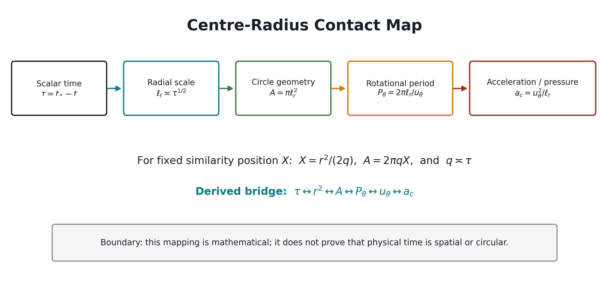
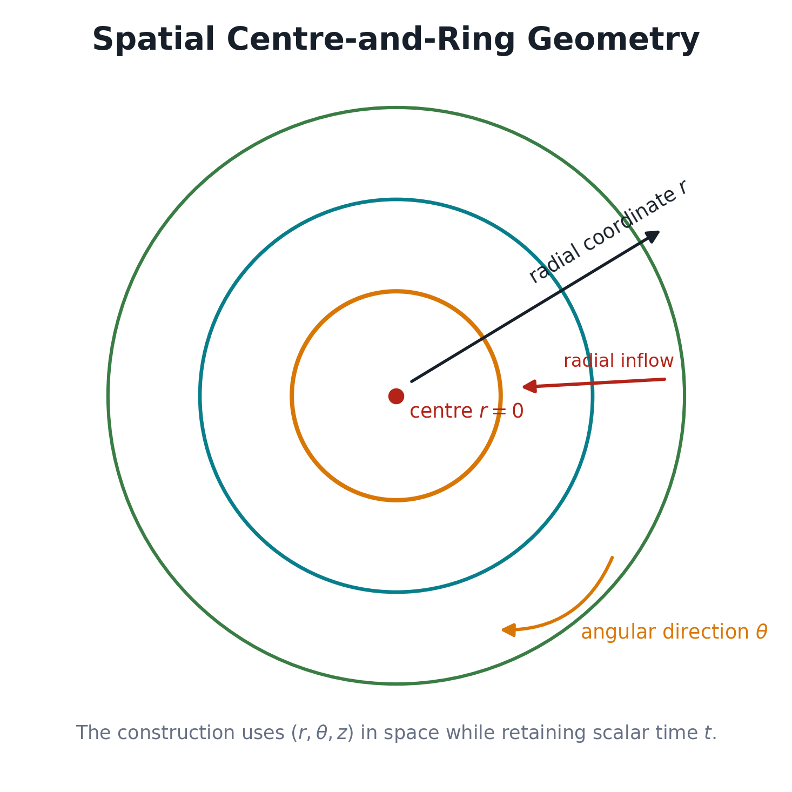
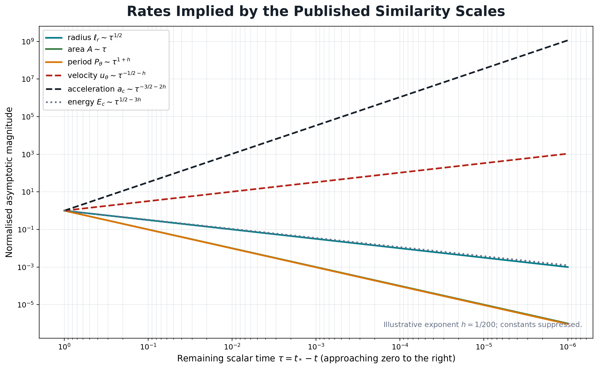

# Abstract

This research note follows a question posed by David Penny: take the Navier-Stokes equation, examine the assumptions and process used by the AI system that produced OpenAI's 2026 finite-time blow-up construction, compare that structure with circular geometry through pi, and identify the closest mathematical points of contact with a centre-outward, nonlinear and potentially layered understanding of time.

The comparison finds a precise mathematical contact. OpenAI's construction retains a conventional one-dimensional scalar time coordinate `t` and defines the remaining time to singularity as

```math
\tau=t_*-t,
\qquad t_*=1.
```

Inside its cylindrical similarity coordinates it defines

```math
X=\frac{r^2}{2q},
```

with `q` comparable to `tau` in the concentrating core and exactly `q=tau` on the central plane `z=0`. Circle geometry then gives, for fixed `X` on that plane,

```math
\mathcal A=\pi r^2=2\pi X\tau.
```

Combining this identity with the paper's azimuthal-velocity scaling yields explicit nonlinear relations among remaining scalar time, radius, circular area, angular speed, rotational period, centripetal acceleration, pressure gradient and angular momentum. It also shows multiple local process times changing at different rates while all remain parameterised by the same scalar `t`.

The result is a genuine structural bridge. It is not evidence that physical time is literally circular, spatial, centre-outward or multidimensional. Radius and angle remain spatial coordinates in the source construction, and the global time variable remains scalar and ordered. The component mathematics also has substantial prior art, including the standard parabolic relation between spatial radius `r` and time scale `r^2`. The contribution of this note is therefore the explicit comparative process, consolidated derivation and interpretive boundary, not a claim that the underlying equations or scaling laws were previously unknown.

**Keywords:** Navier-Stokes, finite-time blow-up, circular geometry, pi, similarity variables, scalar time, local timescales, centre-outward time, AI-assisted mathematics, AQDS.



# 1. David's Original Question and Centre-Outward Time Proposition

## 1.1 Controlling question

David's instruction was to compare three processes without first replacing their assumptions with ours:

1. circular geometry expressed through pi;
2. the Navier-Stokes equation;
3. the process and mathematical construction used by OpenAI's AI system.

The exact directive is preserved in `evidence/DIRECTIVE_RECORD.md`. In normalised research language, the question is:

> When the published AI construction is examined inside its own scalar-time and Newtonian-fluid assumptions, where does its centre-radius-rotation structure make exact mathematical contact with circular geometry, and what does that contact permit or not permit us to infer about a centre-outward model of time?

This order matters. The source equation and construction are first represented as they are. David's interpretation is applied only after the source variables and assumptions have been identified.

## 1.2 Minimal statement of David's proposition

David's proposition is that time may not be exhausted by a single universal linear ordering. An accessed event can be considered a centre from which temporal relation extends outward, potentially through more than one level, direction or dimensional layer. Past, present and future would then be path- or layer-dependent relations to a centre rather than only positions on one line.

To record those stated elements without imposing an unapproved physical law, a minimal coordinate scaffold is

```math
\mathcal T_D
=\{(\rho,\theta,\lambda):
\rho\ge 0,\ \theta\in S^1,\ \lambda\in\Lambda\}.
```

Here:

- `rho` is a possible outward temporal radius from an accessed centre;
- `theta` is a possible phase or directional coordinate;
- `lambda` identifies a possible temporal layer or level;
- `Lambda` is not yet specified;
- no metric, causal law or evolution operator is assumed at this stage.

This scaffold is bookkeeping for the proposition, not a completed theory. A physical model would additionally need a temporal geometry `g_T`, a causal ordering, an evolution rule and observable predictions. For example, a path through such a structure would be

```math
\gamma(s)=(\rho(s),\theta(s),\lambda(s)),
```

and path dependence would require demonstrating that two admissible paths between comparable states can produce distinguishable outcomes.

## 1.3 The initial evidential boundary

Three levels must remain separate:

```math
\text{experienced or proposed structure}
\ne
\text{mathematical representation}
\ne
\text{experimentally established physical law}.
```

The proposition supplies the research direction. The comparison below tests whether the source mathematics contains a precise structural contact. It does not assume that finding a contact proves the proposition.



# 2. The Published Navier-Stokes Equation and AI Methodology

## 2.1 Governing equation

The OpenAI paper studies the three-dimensional incompressible Navier-Stokes equations in the form

```math
\partial_t u+(u\cdot\nabla)u-\nu\Delta u+\nabla p=f,
\qquad
\nabla\cdot u=0,
\qquad
u(\cdot,0)=0.
```

The variables are:

- `x in R^3`: spatial position;
- `t in [0,1)`: scalar time;
- `u(x,t)`: velocity vector field;
- `p(x,t)`: kinematic pressure, meaning pressure divided by constant density;
- `nu>0`: kinematic viscosity;
- `f(x,t)`: external force per unit mass.

The material acceleration is

```math
\frac{D u}{D t}
=\partial_t u+(u\cdot\nabla)u.
```

The momentum equation can therefore be written

```math
\frac{D u}{D t}
=\nu\Delta u-\nabla p+f.
```

This is Newton's second law per unit mass for the continuum model. The equation is nonlinear because of `(u dot grad)u`; the time derivative `partial_t` itself uses one scalar time coordinate.

## 2.2 Scope of the published claim

OpenAI's Theorem 1.1 states that for each positive viscosity it constructs smooth velocity and pressure fields on `R^3 x [0,1)`, together with a smooth compactly supported force, such that

```math
\sup_{0\le t<1}\|u(t)\|_{L^2(\mathbb R^3)}<\infty,
\qquad
\limsup_{t\uparrow 1}\|u(t)\|_{L^\infty(\mathbb R^3)}=\infty.
```

In plain terms, the model begins at rest, retains bounded kinetic energy, yet develops unbounded velocity by the finite time `t=1`. The paper states that this establishes alternatives C and D in the official Clay formulation. This AQDS note accurately uses the published theorem and formulas but does not independently validate all 166 pages or the accompanying Lean formalisation.

## 2.3 AI discovery process

The publication announcement describes a coordinated search rather than one isolated model response. The reported process was:

1. Groups of agents received different variants of the Millennium problem, including proof directions A-B and breakdown directions C-D.
2. Other groups worked on related easier problems, including the Euler regularity problem without viscosity.
3. After an Euler construction was produced, agent resources were redirected toward Navier-Stokes and given relevant intermediate material.
4. Different groups explored diverse approaches.
5. Codex consolidated useful intermediate results across groups and supplied them to follow-up groups.
6. The reported Navier-Stokes construction was reached after about 88 hours.
7. A Lean formalisation and verification stage reportedly required a further 17 hours using GPT-6 Astra.

OpenAI reports that the Navier-Stokes effort involved on the order of 10,000 concurrent agents, approximately 2.7 million messages and approximately 130 billion output tokens. These figures describe the search process; they do not change the mathematical assumptions of the supplied problem.

## 2.4 Mathematical construction process

The source paper's mathematical process can be reduced, without claiming that this summary replaces its proof, to the following chain.

### Step A - Define the residual

At viscosity one, define

```math
R(u,p)=\partial_tu+(u\cdot\nabla)u-\Delta u+\nabla p.
```

For any selected incompressible fields `u,p`, setting

```math
f=R(u,p)
```

makes the forced equation hold. The hard part is making `u` blow up while the resulting `f` and all required derivatives remain smooth.

### Step B - Build a centre-focused cylindrical vortex

The spatial coordinates are

```math
x=(r\cos\theta,r\sin\theta,z),
```

with velocity components

```math
u=u_r e_r+u_\theta e_\theta+u_z e_z.
```

The leading field is axisymmetric, so its cylindrical components do not depend on `theta`. The core spirals radially inward while carrying fluid axially away from the middle region. There is also radial outflow in other parts of the inner profile.

### Step C - Concentrate through anisotropic similarity variables

The paper sets

```math
\tau=1-t,
\qquad
\alpha=\frac12+h,
\qquad
D=\frac12-h,
\qquad
0<h<\frac1{100}.
```

The paper denotes the exponent `alpha` by `A`; this note renames it to prevent collision with circular area. It then introduces

```math
\tau=q(1-\eta^2),
\qquad
z=q^D\eta,
\qquad
X=\frac{r^2}{2q}.
```

In fixed compact similarity regions, `q` is comparable to `tau`. On the plane `z=0`, one has `eta=0` and therefore `q=tau` exactly.

The leading tangential fields have the form

```math
u_\theta^{(0)}=q^{-\alpha}E(X,\eta),
\qquad
u_z^{(0)}=q^{-\alpha}U(X,\eta).
```

### Step D - Balance radial pressure against swirl

The leading radial pressure equation is

```math
\partial_r p^{(0)}
=\frac{\left(u_\theta^{(0)}\right)^2}{r}.
```

Pressure decreases toward the axis and supplies the centripetal acceleration of the swirl.

### Step E - Correct the annular residual with complete-ring pulses

The core is joined to an exterior flow across an annulus. The background residual there would become singular. Oscillatory pulses extending around complete rings are chosen so that their mean velocity can vanish while quadratic velocity products supply a nonzero mean momentum flux. The angular average is normalised by the full circle:

```math
\langle F\rangle_\theta
=\frac1{2\pi}\int_0^{2\pi}F(r,\vartheta,z,t,Y)\,d\vartheta.
```

### Step F - Iterate, localise and preserve smooth forcing

Successive corrections improve the residual, fields are localised using smooth cutoffs, and the resulting residual is extended as a compactly supported smooth external force. The velocity-growth path at the centre is retained.

## 2.5 Methodological conclusion

The AI process searched widely inside the formal problem and found a highly structured construction. It did not compare alternative ontologies of time. Its proof target already supplied `t` as a real scalar variable, velocity as change relative to `t`, and force as material acceleration relative to `t`.

# 3. Underlying Assumptions, Including Scalar Ordered Time

## 3.1 Assumption register

| Assumption | Mathematical form | Consequence |
|---|---|---|
| One time parameter | `t in [0,1) subset R` | Events in the model are ordered by one scalar coordinate. |
| Remaining time | `tau=1-t` | `tau` is a reversed scalar distance to the selected singular time, not a new time dimension. |
| Euclidean space | `x in R^3` | Radius and angle are spatial coordinates. |
| Continuum fluid | fields `u(x,t),p(x,t)` | Individual molecules are not tracked. |
| Incompressibility | `div u=0` | Local volume is preserved by the idealised flow. |
| Constant normalised density | `p=P/rho_f` | `grad p` is pressure force per unit mass. |
| Positive viscosity | `nu>0` | Diffusion acts against velocity gradients. |
| Smooth external forcing | `f in C_c^infinity` | The blow-up cannot be attributed to an externally singular force. |
| Axisymmetric leading field | `partial_theta u^(0)=0` | The dominant cylindrical components are independent of angle. |
| Selected centre and time | `(x,t)=(0,1)` | The construction is organised around a spatial centre and a terminal scalar time. |
| Anisotropic contraction | `ell_r asymp tau^(1/2)`, `ell_z asymp tau^(1/2-h)` | Radial and axial lengths shrink at different rates. |

## 3.2 What "linear time" means here

The phrase "linear time" should be used precisely. The equation does not prove that physical time is metaphysically linear. It represents evolution using one real-valued, ordered coordinate `t`, and all time derivatives refer to that coordinate.

A nonlinear reparameterisation

```math
s=\phi(t),
\qquad
\partial_t u=\frac{d\phi}{dt}\,\partial_su
```

can change the numerical rate assigned to an evolution while leaving the time domain one-dimensional. Reparameterising one coordinate is therefore not the same as introducing multiple temporal dimensions or layers.

A genuine multi-time model with independent coordinates

```math
\boldsymbol\tau=(\tau^1,\ldots,\tau^m)
```

would need to replace the single derivative by a specified temporal-direction operator, for example

```math
\partial_tu
\longrightarrow
T^a\nabla_{\tau^a}u,
```

and would need compatibility or path-dependence rules. No such structure appears in the source Navier-Stokes theorem.

## 3.3 Velocity and force assumptions

Velocity is a vector field with physical dimension

```math
[u]=L\,T^{-1}.
```

Every term in the momentum equation has acceleration dimension:

```math
[\partial_tu]
=[(u\cdot\nabla)u]
=[\nu\Delta u]
=[\nabla p]
=[f]
=L\,T^{-2}.
```

This confirms that the equation's pressure gradient, viscous term and external force are compared through the same scalar-time measurement used for acceleration.

The nonlinearity is

```math
(u\cdot\nabla)u,
```

which means that velocity transports velocity through space. This is different from declaring the time domain itself nonlinear.

## 3.4 Centre, direction and layer assumptions in the source

The source does contain a centre, radial direction and nested scales, but they have specific meanings:

```math
\text{centre}=x=0,
\qquad
\text{radial direction}=e_r,
\qquad
\text{angular direction}=e_\theta,
\qquad
\text{scale layers}=q\downarrow0.
```

The flow direction is not simply centre-outward. The central mechanism includes radial inflow, axial outflow, an annulus and an exterior swirl. The geometry is centre-indexed; the fluid motion has several directions.

# 4. Complete Mathematical Derivation: Radius, Pi, Area, Circumference, Rotation, Velocity, Pressure and Force

## 4.1 Circle geometry

For a circle of radius `r`,

```math
C=2\pi r,
\qquad
\mathcal A=\pi r^2.
```

This note uses `mathcal A` for circular area so it cannot be confused with the exponent called `A` in the source paper.

The cylindrical volume element is

```math
dV=r\,dr\,d\theta\,dz.
```

Integrating through a complete angle gives

```math
\int_0^{2\pi}r\,d\theta=2\pi r,
```

and integrating from the axis to radius `R` gives the disc area

```math
\int_0^R2\pi r\,dr=\pi R^2.
```

Pi therefore enters the construction through closed angular geometry, angular averaging, ring length, cross-sectional area and cylindrical volume. It is not an independent force term in Navier-Stokes.

## 4.2 Rotation and local cycle time

Let

```math
\Omega=\frac{d\theta}{dt}
```

be angular speed. Tangential speed is

```math
u_\theta=r\Omega.
```

If `P_theta` is the local time for one complete revolution, then

```math
\Omega=\frac{2\pi}{P_\theta},
```

so

```math
\boxed{
P_\theta=\frac{2\pi}{\Omega}
=\frac{2\pi r}{u_\theta}
=\frac{C}{u_\theta}.}
```

This is the first direct connection among pi, radius, velocity and a local process time.

## 4.3 Acceleration, pressure and force

The magnitude of centripetal acceleration is

```math
a_c=\frac{u_\theta^2}{r}.
```

Substituting `u_theta=2 pi r/P_theta` gives

```math
\boxed{
a_c
=\frac{4\pi^2r}{P_\theta^2}.}
```

For a parcel of mass `m`, the corresponding force magnitude is

```math
F_c=m a_c
=\frac{4\pi^2mr}{P_\theta^2}.
```

For a continuum with physical mass density `rho_f`, the force per volume is

```math
\rho_f a_c
=\frac{\rho_f u_\theta^2}{r}.
```

The source paper normalises by density and imposes the leading radial pressure balance

```math
\boxed{
\partial_rp^{(0)}
=\frac{(u_\theta^{(0)})^2}{r}
=a_c.}
```

This pressure gradient is an internal pressure-force term. It must not be confused with the smooth external residual force `f`. The construction arranges cancellations among individually large acceleration, pressure and viscous terms so that `f` remains smooth.

## 4.4 Angular momentum, area and period

Let the specific angular momentum be

```math
j=r u_\theta.
```

Then

```math
P_\theta
=\frac{2\pi r}{u_\theta}
=\frac{2\pi r^2}{r u_\theta}
=\frac{2\pi r^2}{j}.
```

Because `mathcal A=pi r^2`,

```math
\boxed{
P_\theta=\frac{2\mathcal A}{j}.}
```

If `j` were constant for an unforced, torque-free parcel, the local cycle time would be directly proportional to the circular area. In the actual viscous construction, `j` is not constant across the whole process; it has its own scaling derived below.

## 4.5 Exact contact with the paper's similarity coordinate

The paper defines

```math
X=\frac{r^2}{2q}.
```

Therefore

```math
r^2=2qX.
```

Substitution into circle area gives the exact identity

```math
\boxed{
\mathcal A
=\pi r^2
=2\pi qX.}
```

The corresponding circumference is

```math
\boxed{
C=2\pi\sqrt{2qX}.}
```

On `z=0`, the paper's relations imply `eta=0` and `q=tau`. At any fixed similarity position `X>0` on that plane,

```math
r(\tau)=\sqrt{2X\tau},
```

and consequently

```math
\boxed{
\mathcal A(\tau)=2\pi X\tau,}
```

```math
\boxed{
C(\tau)=2\pi\sqrt{2X\tau}.}
```

The first equation is the strongest exact point of contact: within the selected similarity path, the circle's cross-sectional area is linear in the source paper's remaining scalar time even though its radius is proportional to the square root of that time.

More generally, within a fixed compact core chart, `q asymp tau`, so

```math
\mathcal A\asymp2\pi X\tau,
\qquad
C\asymp2\pi\sqrt{2X}\,\tau^{1/2}.
```

## 4.6 Exact leading path for velocity, period and acceleration

On a fixed inner circle `X=X_in` at `z=0`, the paper gives

```math
u_\theta
=\tau^{-\alpha}
\left(e_0+O(\tau^{2h})\right),
\qquad
\alpha=\frac12+h,
\qquad
e_0>0.
```

Using

```math
r=\sqrt{2X_{\rm in}\tau},
```

the angular speed is

```math
\Omega
=\frac{u_\theta}{r}
=\frac{e_0}{\sqrt{2X_{\rm in}}}
\tau^{-1-h}
\left(1+O(\tau^{2h})\right).
```

The rotational period is

```math
\boxed{
P_\theta
=\frac{2\pi\sqrt{2X_{\rm in}}}{e_0}
\tau^{1+h}
\left(1+O(\tau^{2h})\right).}
```

The centripetal acceleration and leading radial pressure gradient are

```math
\boxed{
a_c
=\partial_rp^{(0)}
=\frac{e_0^2}{\sqrt{2X_{\rm in}}}
\tau^{-3/2-2h}
\left(1+O(\tau^{2h})\right).}
```

The specific angular momentum is

```math
\boxed{
j=r u_\theta
=\sqrt{2X_{\rm in}}\,e_0
\tau^{-h}
\left(1+O(\tau^{2h})\right).}
```

These formulas verify one another through

```math
P_\theta=\frac{2\mathcal A}{j}.
```

They show that as `tau` approaches zero:

- radius decreases as `tau^(1/2)`;
- area decreases as `tau`;
- rotational period decreases as `tau^(1+h)`;
- angular speed increases as `tau^(-1-h)`;
- azimuthal velocity increases as `tau^(-1/2-h)`;
- centripetal acceleration and radial pressure gradient increase as `tau^(-3/2-2h)`;
- specific angular momentum increases mildly as `tau^(-h)` in the selected path.

## 4.7 Volume and bounded-energy compatibility

The source scales are

```math
\ell_r\asymp\tau^{1/2},
\qquad
\ell_z\asymp\tau^{1/2-h}.
```

The core volume therefore scales as

```math
V_{\rm core}
\asymp\pi\ell_r^2\ell_z
\asymp\pi\tau^{3/2-h}.
```

The dominant squared velocity scales as

```math
u_{\rm dom}^2\asymp\tau^{-1-2h}.
```

Hence the leading kinetic-energy scale is

```math
E_{\rm core}
\asymp\frac12V_{\rm core}u_{\rm dom}^2
\asymp\tau^{1/2-3h}.
```

Because

```math
0<h<\frac1{100}<\frac16,
```

one has

```math
\frac12-3h>0,
\qquad
E_{\rm core}\longrightarrow0
\quad(\tau\downarrow0),
```

even while the maximum velocity becomes unbounded.

## 4.8 Established parabolic scale

The official Clay problem statement defines parabolic spacetime cylinders with spatial radius `r` and time-interval length `r^2`:

```math
Q_r=B_r\times I_r,
\qquad
|I_r|=r^2.
```

Thus

```math
\Delta t\sim r^2
```

is standard diffusion/PDE scaling. The new note must not claim discovery of the radius-squared time relation itself. Its task is to expose how that known scale, circle geometry, rotational kinematics and the particular 2026 construction combine into one contact map.



# 5. The Identified Mathematical Relationship

## 5.1 Consolidated contact map

Suppressing fixed positive profile factors while retaining the governing exponents, the comparison gives

```math
\boxed{
\begin{aligned}
\tau&=t_*-t,\\
r&\asymp\tau^{1/2},\\
\mathcal A&=\pi r^2\asymp\pi\tau,\\
u_\theta&\asymp\tau^{-1/2-h},\\
\Omega&=u_\theta/r\asymp\tau^{-1-h},\\
P_\theta&=2\pi/\Omega\asymp\tau^{1+h},\\
a_c&=u_\theta^2/r\asymp\tau^{-3/2-2h},\\
\partial_rp^{(0)}&=a_c,\\
j&=r u_\theta\asymp\tau^{-h},\\
E_{\rm core}&\asymp\tau^{1/2-3h}.
\end{aligned}}
```

The conceptual sequence is

```math
\boxed{
\text{remaining scalar time}
\longleftrightarrow r^2
\longleftrightarrow\text{circular area}
\longleftrightarrow\text{rotational period}
\longleftrightarrow\text{velocity}
\longleftrightarrow\text{acceleration and pressure force}.}
```

## 5.2 Radial parameterisation of remaining time

Define a radial scale parameter

```math
\rho=\sqrt{\tau}.
```

This is a reversible change of variable for `tau>0`:

```math
\tau=\rho^2.
```

The contact map becomes

```math
\boxed{
\begin{aligned}
r&\asymp\rho,\\
\mathcal A&\asymp\pi\rho^2,\\
u_\theta&\asymp\rho^{-1-2h},\\
\Omega&\asymp\rho^{-2-2h},\\
P_\theta&\asymp\rho^{2+2h},\\
a_c&\asymp\rho^{-3-4h},\\
j&\asymp\rho^{-2h},\\
E_{\rm core}&\asymp\rho^{1-6h}.
\end{aligned}}
```

This is the closest mathematical contact with David's centre-outward proposition: a radial parameter can encode the source construction's remaining time and organise every listed process rate around the selected centre.

It is still a parameterisation. The derivation does not establish that `rho` is an independent physical time dimension.

## 5.3 Multiple local timescales inside one scalar time

The construction contains several local process times. A radial viscous-diffusion time is

```math
T_\nu\sim\frac{\ell_r^2}{\nu}\asymp\tau.
```

The source gives only the one-sided radial transport-rate estimate

```math
\frac{|u_r|}{\ell_r}=O(\tau^{-1}).
```

Thus, wherever `u_r` is nonzero, the corresponding radial transport time

```math
T_r:=\frac{\ell_r}{|u_r|}\gtrsim\tau
```

has a lower-bound scale. The source does not supply the two-sided asymptotic needed to write `T_r\asymp\tau`.

The axial transport time is

```math
T_z\sim\frac{\ell_z}{|u_z|}\asymp\tau.
```

The rotational period is

```math
P_\theta\asymp\tau^{1+h}.
```

Therefore

```math
\frac{P_\theta}{T_\nu}\asymp\tau^h\longrightarrow0.
```

Increasingly many rotations occur within one radial diffusion time. The source paper expresses the same effect through the growing angular Reynolds number

```math
\operatorname{Re}_\theta
=\frac{|u_\theta|\ell_r}{\nu}
\asymp\tau^{-h}
\longrightarrow\infty.
```

One scalar `t` can therefore contain nested operational clocks whose periods separate nonlinearly. That is a mathematically supported statement. It is not equivalent to proving multiple independent dimensions of physical time.

## 5.4 Comparative finding

The overall finding is:

> OpenAI's published construction remains conditional on one ordered scalar time, but its central mechanism is organised through a spatial centre, squared radius, complete circular paths, nested scales and diverging local rates. Circle geometry turns the source variable `X=r^2/(2q)` into the exact area-time identity `mathcal A=2 pi X tau` on the central plane. The resulting local rotational clock, velocity and pressure-force scales evolve nonlinearly relative to the global scalar clock. This supplies a rigorous mathematical bridge to David's centre-outward time proposition, while stopping short of proving that time itself possesses that geometry.

# 6. Evidence Boundary: Published Mathematics, Derived Mathematics and Research Hypothesis

## 6.1 Four evidence classes

| Class | Content | Evidential status |
|---|---|---|
| Published source mathematics | Navier-Stokes equation, theorem statement, cylindrical variables, `X=r^2/(2q)`, scales and pressure balance | Verified as accurately transcribed from the preserved source PDF |
| Independently derived mathematics | Circle substitutions, period relations, acceleration relation, exact area identity and exponent propagation | Verified algebraically by the included SymPy script |
| Comparative interpretation | Scalar time can parameterise nested nonlinear local process times organised by radius | Supported by the derivation, but interpretive |
| Physical-time hypothesis | Time itself is centre-outward, circular, layered or multidimensional | Not verified yet |

## 6.2 What the mathematics establishes

The following statements follow from the source formulas and standard geometry:

```math
X=\frac{r^2}{2q}
\quad\Longrightarrow\quad
\mathcal A=2\pi qX.
```

```math
q=\tau\ \text{on }z=0
\quad\Longrightarrow\quad
\mathcal A=2\pi X\tau.
```

```math
u_\theta\asymp\tau^{-1/2-h}
\quad\Longrightarrow\quad
P_\theta\asymp\tau^{1+h},
\quad
a_c\asymp\tau^{-3/2-2h}.
```

These are mathematical consequences, not statements about subjective time or temporal ontology.

## 6.3 What the mathematics does not establish

The comparison does not establish any of the following:

```math
\theta_{\rm spatial}=\theta_{\rm temporal},
```

```math
r_{\rm spatial}=\rho_{\rm temporal},
```

```math
\tau=\text{a fundamental radial dimension of physical time},
```

or

```math
\text{mathematical contact}=\text{empirical proof}.
```

It also does not prove that time is linear. The source theorem stipulates a one-dimensional real time parameter and proves a conditional result within that model.

## 6.4 Proof-status boundary for the OpenAI paper

This note uses OpenAI's published formulas conditionally. It has preserved and hashed the paper, checked the relevant displayed equations, and linked the public Lean repository. It has not:

- reconstructed every analytical estimate;
- completed an independent local Lean build;
- obtained specialist peer review of the 166-page proof;
- established final Clay Mathematics Institute acceptance.

Those higher proof classes remain `Not verified yet` here.

## 6.5 Requirement for physical advancement

To progress from contact map to physical theory, a future model would need at least:

1. a defined temporal state space and metric;
2. a causal rule across radii, directions and layers;
3. a replacement or extension for the scalar derivative;
4. a reduction recovering ordinary Navier-Stokes when the additional structure is inactive;
5. a prediction that differs from the scalar-time model;
6. an observation capable of deciding between the models.

Formally, if a future temporal derivative were proposed as

```math
\mathcal D_Tu=T^a\nabla_{\tau^a}u,
```

then a corresponding fluid hypothesis might begin with

```math
\mathcal D_Tu
+(u\cdot\nabla_x)u
-\nu\Delta_xu
+\nabla_xp
=f.
```

This equation is a future research template, not a result established in this note.

# 7. Transparent Comparison Methodology

## 7.1 Auditable process

The comparison followed the controlled sequence

```math
\boxed{
\mathcal R
=\operatorname{Classify}
\circ\operatorname{PriorArt}
\circ\operatorname{Verify}
\circ\operatorname{Derive}
\circ\operatorname{Extract}(S),}
```

where `S` is the authoritative source set and `mathcal R` is this research note.

### Extract

- Preserve the official OpenAI and Clay PDFs locally.
- Record URLs, retrieval date and SHA256 hashes.
- Extract the theorem, equation, coordinates, similarity variables, exponents, pressure balance and angular-average definition.

### Derive

- Introduce circle circumference and area.
- Substitute `r^2=2qX` into `mathcal A=pi r^2`.
- Restrict only where the source explicitly permits `q=tau`.
- derive `Omega`, `P_theta`, `a_c` and `j` through standard identities.
- propagate the source exponents without changing them.

### Verify

- Simplify each algebraic identity symbolically.
- check the dimensions of every Navier-Stokes momentum term.
- compare the derived energy exponent with the source paper.
- generate a representative numerical sample using `h=1/200`, which satisfies `0<h<1/100`.

### PriorArt

- Check the Clay statement for parabolic scaling.
- check Leray-type self-similar scaling.
- check established axisymmetric swirl notation.
- identify earlier structural and multidimensional-time proposals.
- do not infer novelty from an unsuccessful search.

### Classify

- mark each statement as source, derived, interpretive or hypothetical;
- attach the evidence source;
- prevent a lower proof class from being presented as a higher one.

## 7.2 Symbolic verification

The included script `scripts/verify_derivations.py` checks ten identities. Its required result is

```math
\forall i\in\{1,\ldots,10\},
\qquad
\operatorname{simplify}(L_i-R_i)=0.
```

The checked identities include

```math
P_\theta-\frac{C}{u_\theta}=0,
```

```math
P_\theta-\frac{2\mathcal A}{j}=0,
```

```math
a_c-\frac{4\pi^2r}{P_\theta^2}=0,
```

```math
\pi\left(\sqrt{2qX}\right)^2-2\pi qX=0,
```

plus the radius, area, period, acceleration, angular-momentum, volume and energy exponents.

The current executable result is:

```text
all_symbolic_checks_zero = true
navier_stokes_acceleration_terms_match = true
SymPy version = 1.14.0
expression_set_sha256 = A050DF973156ED148969A54CCE1CAC3CB5D050C3787A839F893DD8ED9EB1A7FE
```

## 7.3 Bounded prior-art result

The review identified prior art for:

- `Delta t sim r^2` parabolic scaling;
- self-similar velocity and spatial scaling near a candidate blow-up time;
- axisymmetric swirl `Theta=r u_theta`;
- multidimensional or structurally dependent models of time;
- physical theories containing more than one time coordinate.

It did not identify the exact comparative synthesis made here. Because the search is bounded and not an exhaustive scholarly review, novelty remains

```math
\boxed{\text{Not verified yet and not claimed}.}
```

## 7.4 Reproducibility boundary

The transparent method provides reproducible algebra and provenance, not hidden model reasoning. A reader can rerun the symbolic script, inspect each substitution, compare the formulas with the cited pages and challenge the interpretation independently.

# 8. Sources, Evidence Hashes and AQDS GitHub Record

## 8.1 Authoritative evidence files

| Evidence | Role | SHA256 |
|---|---|---|
| OpenAI, `Finite Time Blowup for Navier-Stokes` | Primary source construction | `0E779481C4DA40BD28D1E642E1D8CA57447D129610DF28DFA5A11E9AF8AE228F` |
| Clay Mathematics Institute, official Navier-Stokes problem | Official equation and alternatives A-D | `C1B5F27B1A64705CFAF1AFCEEA513DB5DEEDCA8A18CA56AB32E7F86445A06D0C` |
| Symbolic expression set | Reproducible algebra set | `A050DF973156ED148969A54CCE1CAC3CB5D050C3787A839F893DD8ED9EB1A7FE` |

The complete claim-level mapping is in `evidence/CLAIM_LEDGER.md`. The full source list is in `evidence/SOURCE_LEDGER.md`.

## 8.2 Core references

1. OpenAI. "Finite Time Blowup for Navier-Stokes." 2026. https://cdn.openai.com/pdf/32d9f210-8b73-45e0-91bc-82a30aef8a9a/navier-stokes.pdf
2. OpenAI. "On the Navier-Stokes Millennium Prize Problem." 8 September 2026. https://openai.com/index/navier-stokes-solution/
3. OpenAI. `NavierStokesAndEuler`: Lean certificates accompanying the published results. https://github.com/openai/NavierStokesAndEuler
4. Fefferman, Charles L. "Existence and Smoothness of the Navier-Stokes Equation." Clay Mathematics Institute. https://www.claymath.org/wp-content/uploads/2022/06/navierstokes.pdf
5. He, Xinyu. "Existence of Leray's Self-Similar Solutions of the Navier-Stokes Equations." *Canadian Mathematical Bulletin* 47(1), 2004, 30-37. https://doi.org/10.4153/CMB-2004-005-3
6. W. S. Ożański and S. Palasek. "Quantitative Control of Solutions to the Axisymmetric Navier-Stokes Equations in Terms of the Weak L3 Norm." *Annals of PDE* 9, article 15, 2023. https://doi.org/10.1007/s40818-023-00156-7
7. Atkin, R. H. "Time as a Pattern on a Multi-Dimensional Structure." *Journal of Social and Biological Structures* 1(3), 1978, 281-295. https://doi.org/10.1016/0140-1750(78)90027-1
8. Bars, Itzhak. "Two-Time Physics." 1998. https://arxiv.org/abs/hep-th/9809034

## 8.3 AQDS public record

The intended publication chain is

```math
\text{local controlled package}
\longrightarrow
\text{David-approved AQDS GitHub release}
\longrightarrow
\text{Zenodo archival deposit and DOI}.
```

Current status:

- AQDS GitHub repository URL: `https://github.com/aqdsintel-source/Centre-Radius-and-Time`.
- Zenodo DOI: recorded in the repository metadata after the initial archival deposit.
- Publication licences: `CC BY 4.0 for the paper and AQDS-authored research material; MIT for original reproducibility scripts`.
- External publication: `AUTHORIZED PUBLIC-REVIEW RELEASE BY DAVID PENNY`.
- Version: `v1.0-public-review`.
- Contact: `AQDS <aqds.intel@gmail.com>`.

Third-party source PDFs are retained as local verification evidence. They will not automatically be redistributed in the public repository; the release can cite and link to the authoritative copies unless redistribution rights are separately verified.

## 8.4 Final publication hash

The public package records the SHA256 identity of every released file in
`evidence/RELEASE_MANIFEST_SHA256.txt`. In compact form,

```math
H_{\rm release}
=\operatorname{SHA256}(\text{approved release files}).
```

These hashes establish artifact identity and change detection. They do not
establish mathematical truth, peer review, physical validation or scientific
acceptance.

# 9. Attribution and Contributions

## 9.1 Visible attribution

The manuscript attribution is:

**David Penny**  
Originating concept, research direction, interpretive framework and accountable human author.

**Helios**  
AI analytical collaborator, mathematical derivation assistance, source comparison, reproducibility tooling and document preparation under AQDS governance.

## 9.2 Contribution structure

The controlled contribution relationship is

```math
\mathcal W
=\left(C_D,A_H,V_D\right),
```

where

```math
C_D=\text{David's originating concept and direction},
```

```math
A_H=\text{Helios's disclosed analytical and drafting assistance},
```

```math
V_D=\text{David's human review, correction, approval and accountability}.
```

The work is incomplete until the final `V_D` gate is satisfied.

## 9.3 AI-use disclosure

For the drafting sessions dated 13-14 September 2026, Helios operated through OpenAI Codex using the locally configured `gpt-5.6-sol` model and ultra reasoning effort. It was used to locate and compare sources, formalise the agreed comparison, derive the circle/rotation/similarity relationships, create reproducibility scripts, run symbolic checks, prepare figures and draft the research note. David supplied the originating centre-outward time proposition, directed the three-part comparison, required the mathematical contact analysis, selected open publication, directed the governance closure and retained final authority over the work. The model and tool disclosure must be rechecked if later revisions use a different configuration.

The AI contribution is disclosed rather than concealed. Helios cannot accept legal or scholarly accountability. On a platform such as Zenodo that prohibits AI tools in author, creator or contributor metadata, David will be the formal human creator, while Helios remains visibly credited in this manuscript, its methodology and its AI-use disclosure.

## 9.4 Governance at the point where knowledge is formed

Governance in this work begins before regulation, publication or downstream harm, when an observation, calculation or AI output is first treated as possible knowledge. The rule is the same for a single artificial-intelligence tool and an agentic AI system: computational scale, fluent explanation, autonomous search and agreement among agents do not create epistemic authority. Every material claim must retain its source, assumptions, derivation, evidence class, failed checks, unresolved uncertainty and accountable human decision.

The closed control loop is: human question and permission; AI-assisted search, generation or comparison; evidence capture; reproducible verification; claim classification; human correction and approval; then qualified release or withholding. Failed, conflicting or unknown results return to evidence and correction. Confidence, repetition, institutional prestige, computational scale or media reach cannot promote them to fact. Agents may search, compare, criticise and propose, but may not erase contrary evidence, relocate permission boundaries, self-validate or strengthen public claims beyond the evidence. This governance does not suppress discovery or surveil human thought. It protects human advancement by allowing capability to discover while truth status, correction, accountability and release remain governed. Here, mathematics remains mathematics, interpretation remains interpretation, and the physical-time structure remains a hypothesis until new evidence and David's `V_D` approval gate permit a stronger statement.

## 9.5 Approval statement

On 14 September 2026, David Penny authorized publication through the AQDS GitHub account and Zenodo, together with external review outreach from the AQDS email account. This approval authorizes a public-review release and requests criticism; it does not establish peer review, independent mathematical acceptance or physical validation. Therefore:

```math
\boxed{
\text{public-review release}
\not\Rightarrow
\text{peer reviewed, independently accepted or physically validated}.}
```
